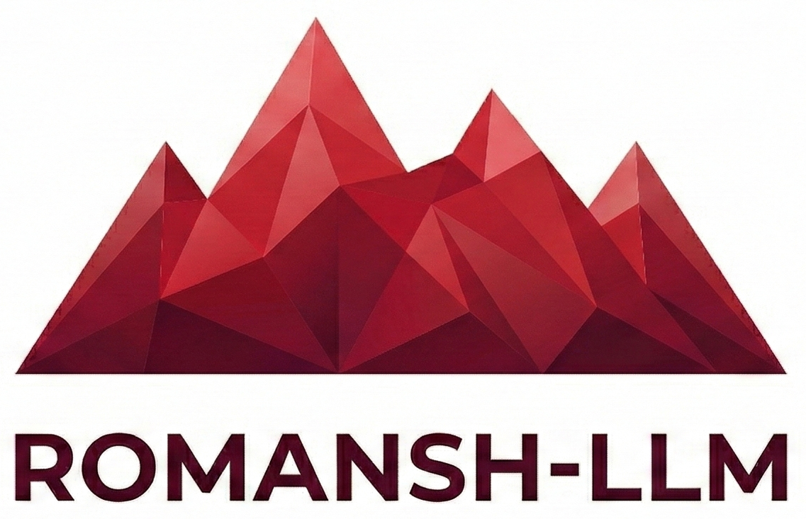

<p align="center">
  
</p>

# Romansh-LLM

**A dialect-aware language model for all six Romansh varieties.**
Continued-pretrained on [ZurichNLP/quotidiana](https://huggingface.co/datasets/ZurichNLP/quotidiana), the only large public Romansh corpus, with QLoRA and optional dialect tags. Instruction tuning and evaluation are planned. One repo, one clear goal: **better language modeling for Romansh.**

**Run (TL;DR):** `uv sync` → `make download-data` → `make pretrain ENV=dev`. For AWS: `make aws-pretrain ENV=dev` (see [Quick start](#quick-start)).

---

## Why this project

Romansh is Switzerland’s fourth national language, with six main written varieties: **Vallader**, **Puter**, **Sursilvan**, **Sutsilvan**, **Surmiran**, and **Rumantsch Grischun**. **Impact:** There is no public, open dialect-aware language model for Romansh; this project aims to be the first. **Realistic:** a single pipeline (data → continued pretraining) that runs on one GPU with QLoRA. Instruction tuning and evaluation are planned; the repo is ready to extend toward NMT when parallel data is available.

---

## What is Romansh-LLM?

**Romansh-LLM** is a **dialect-aware language model** for Romansh. It is:

- **Trained on real data:** [ZurichNLP/quotidiana](https://huggingface.co/datasets/ZurichNLP/quotidiana)—news and similar text with dialect labels.
- **Dialect-aware:** Supports all six varieties; dialect tags condition the model (instruction tuning planned).
- **Lightweight and reproducible:** Continued pretraining with QLoRA, single GPU, small codebase.
- **Extensible:** Same codebase and models can later feed NMT (e.g. dialect-to-dialect or Romansh–German) when parallel or back-translated data is added.

**Deliverables:**

| Deliverable | Description |
|-------------|-------------|
| Data preparation | Scripts to download and prepare quotidiana (train/val, optional dialect tags). ✅ |
| Continued pretraining | QLoRA pretraining on quotidiana with dialect conditioning. ✅ |
| Instruction tuning | SFT for “interact in my dialect” (synthetic instruct data). Planned. |
| Evaluation | Per-dialect perplexity and example generations. Planned. |
| Documentation | This README; dataset and method clearly cited. ✅ |

---

## Data

All training uses the **quotidiana** corpus:

- **Source:** [ZurichNLP/quotidiana](https://huggingface.co/datasets/ZurichNLP/quotidiana) on Hugging Face.
- **Content:** *La Quotidiana* news articles in Romansh with **dialect labels**. Two subsets: `1997_2008` (~146k rows) and `2021_2025` (~13k rows). Varieties: Rumantsch Grischun, Sursilvan, Sutsilvan, Surmiran, Puter, Vallader.
- **License:** CC BY 4.0. © *La Quotidiana*.
- **Note:** Quotidiana is **monolingual** (lots of text per dialect, but not sentence-aligned across dialects). Full **NMT** (e.g. dialect-to-dialect or Romansh–German) would require parallel data (e.g. parallel Bible, manual alignments, or back-translation) and is planned as **future work** in a separate data pipeline and scripts.

---

## Method

1. **Continued pretraining (CPT)**
   QLoRA on the base model over quotidiana. Dialect tags can be used so the model learns variety-specific patterns.

2. **Instruction tuning (planned)**
   SFT with dialect in the prompt (e.g. “Answer in Vallader”) using synthetic instruction data—not yet implemented.

3. **Hardware**
   Single GPU; no large infrastructure. Configuration lives in `configs/` (see [Config](#config) below).

---

## Quick start

**Prerequisites:** Python 3.10–3.12, [uv](https://docs.astral.sh/uv/) (recommended) or pip, one GPU for training. For **AWS**: AWS account, Docker (required for `make aws-pretrain`), Terraform, and `uv sync --extra aws`; the script will warn and fail at build/push if Docker is missing.

**In 30 seconds (local):** `uv sync` → `make download-data` → `make pretrain ENV=dev`. For AWS: `make aws-pretrain ENV=dev` (after Terraform and credentials; see §6).

### 1. Install

```bash
uv sync
```

Check version: `uv run romansh-llm-pretrain -V` (or `--version`).
Log level: set `LOG_LEVEL` (DEBUG, INFO, WARNING, ERROR) in the environment or `.env`, or pass `--log-level` to `romansh-llm-pretrain` and `launch_sagemaker_job.py`.

### 2. Local (no Docker)

Run the pipeline with the two scripts, or use the Makefile (`make help` for all targets):

```bash
./scripts/download_data.sh     # Download and prepare quotidiana
./scripts/pretrain.sh          # Continued pretraining (QLoRA)
```

Or: `make download-data` then `make pretrain`. Use `ENV=dev` for a lighter, faster run: `make pretrain ENV=dev`.

**Make targets** — Use **`ENV=dev`** or **`ENV=prod`** (default) to select config and Terraform environment (see [Config](#config)). Dev uses `configs/dev.yaml` (lighter model, 1 epoch) and a smaller SageMaker instance; prod uses `configs/prod.yaml` and full resources.

| Target | Description |
|--------|--------------|
| `make help` | List all targets |
| `make download-data` | Cache ZurichNLP/quotidiana from Hugging Face |
| `make pretrain` | Run CPT with QLoRA (`ENV=prod` → `configs/prod.yaml`; use `ENV=dev` for fast iteration) |
| `make all` | download-data then pretrain |
| `make tf-init` | Terraform: init |
| `make tf-plan` | Terraform: plan (passes `ENV`) |
| `make tf-apply` | Terraform: apply (separate ECR/IAM/S3 per `ENV`) |
| `make tf-destroy` | Terraform: destroy (for current `ENV`) |
| `make tf-output` | Terraform: show outputs |
| `make docker-build` | Build training image locally |
| `make docker-push` | Push image to ECR (for current `ENV`) |
| `make sagemaker-launch` | Start CPT job (instance type: smaller for dev) |
| `make aws-pretrain` | Full AWS flow for `ENV` (optional: `YES=1`, `SKIP_TERRAFORM=1`, `SKIP_PUSH=1`) |
| `make download-model` | Download trained model from SageMaker S3 (`JOB_NAME=...` required; unpacks to `output/sagemaker/<job>/final/`). The artifact is a Hugging Face–style model (base + QLoRA adapters); load with `transformers` and `peft` for inference or as a base for further fine-tuning. |
| `make job-status` | Check SageMaker training job status in the terminal (`JOB_NAME=...` required; shows Status, Secondary, times, FailureReason if any) |
| `make job-logs` | Show recent training job logs from CloudWatch (`JOB_NAME=...` required; last 2h; for live streaming use AWS CLI v2: `aws logs tail /aws/sagemaker/TrainingJobs --log-stream-name-prefix <JOB_NAME> --follow`) |
| `make install-pre-commit` | Install pre-commit hooks (run once; requires `uv sync --extra dev`) |
| `make pre-commit` | Run pre-commit on all files |

Examples: `make pretrain ENV=dev` | `make aws-pretrain ENV=dev` | `make aws-pretrain ENV=prod`.
One-shot AWS: `ENV=prod make aws-pretrain` or `ENV=dev make aws-pretrain` (dev = lighter infra + smaller instance).

### 3. Config

Configuration is in **`configs/`**: `configs/common.yaml` holds shared defaults; `configs/dev.yaml` and `configs/prod.yaml` override per environment. The Makefile and scripts use `ENV=prod` by default; set `ENV=dev` for the lighter dev config. All paths, model choice, LoRA settings, and training hyperparameters are set there.

### 4. Hugging Face authentication (gated models)

The default base model (e.g. Llama-3.2-3B) is **gated**: you must accept the license on the model page once, then provide a token so training can download it.

1. **Accept the license:** Open the model page on Hugging Face (e.g. [meta-llama/Llama-3.2-3B](https://huggingface.co/meta-llama/Llama-3.2-3B)), log in, and click “Agree and access repository”.
2. **Create a token:** [Settings → Access tokens](https://huggingface.co/settings/tokens) (read access is enough).
3. **Pass the token when running training** (do not commit it). Recommended: use a local `.env` file (gitignored):
   ```bash
   cp .env.example .env
   # Edit .env and set HF_TOKEN=your_token_here (or HUGGING_FACE_HUB_TOKEN)
   make pretrain
   ```
   The script loads `.env` from the repo root automatically. Alternatively, `export HF_TOKEN=...` in your shell before running.

**Security (secrets):** Never commit tokens; use `.env` (gitignored) or AWS Secrets Manager in production.

### 5. Run with Docker (local or cloud GPU)

Build and run CPT in a container (GPU required for training):

```bash
docker build -t romansh-llm .
docker run --gpus all -v $(pwd)/output:/app/output -v $(pwd)/configs:/app/configs romansh-llm
```

- `--gpus all` exposes the GPU. Use `--gpus device=0` for a single GPU.
- Mount `output` so checkpoints are written to the host. Adjust `paths.output_dir` in config to `/app/output/cpt` (or mount a different path and set it accordingly).
- To use a custom config: `-v /path/to/your/configs:/app/configs` and the default `CMD` will use `/app/configs/prod.yaml` (or pass `--config /app/configs/your.yaml`).
- For gated models, pass your Hugging Face token: `-e HF_TOKEN=your_token`.

### 6. Train on AWS SageMaker

You can run continued pretraining as a SageMaker training job so the model runs on a managed GPU instance and artifacts are written to S3. **Docker is required** for the build-and-push step; if it is not installed, `make aws-pretrain` will warn and fail at that step.

**AWS credentials:** Terraform creates an IAM user (`romansh-llm-terraform` by default) with a policy that has the minimum permissions needed for this project (ECR, SageMaker, S3, IAM role for SageMaker). You need existing AWS credentials (e.g. root or an admin) to run the first `terraform apply`. After apply, create an access key for that user in the console (IAM → Users → *user name* → Security credentials → Create access key), then install the AWS CLI via the project (`uv sync --extra aws`) and run:

```bash
uv run aws configure
```

Enter the access key and secret for the Terraform-created user and your default region (e.g. `us-east-1`). Use these credentials for all later runs (`make aws-pretrain`, Terraform, launcher). For multiple accounts, use a [named profile](https://docs.aws.amazon.com/cli/latest/userguide/cli-configure-profiles.html) and set `AWS_PROFILE`. In CI, use environment variables `AWS_ACCESS_KEY_ID`, `AWS_SECRET_ACCESS_KEY`, and `AWS_REGION`. If you see **No valid credential sources found**, run `uv run aws configure` (or create an access key for the Terraform user and configure it).

**Infrastructure:** Use [terraform/](terraform/README.md) or the Makefile. Set **`ENV=dev`** or **`ENV=prod`** (default): each environment has its own ECR repo, IAM role, S3 bucket, and IAM user (e.g. `romansh-llm-dev-*` vs `romansh-llm-prod-*`). Run `make tf-apply ENV=prod` or `make tf-apply ENV=dev`; for a single end-to-end run, **`ENV=prod make aws-pretrain`** or **`ENV=dev make aws-pretrain`** (optional: `--yes`, `--skip-terraform`, `--skip-push`).

1. **Build and push the image** to ECR: `make docker-push ENV=prod` (or `ENV=dev`). Uses Terraform outputs for that environment.

2. **Config and secrets:** Config is chosen by `ENV` (`configs/dev.yaml` or `configs/prod.yaml`; both merge with `configs/common.yaml`). The training script writes to `/opt/ml/model` when `SM_MODEL_DIR` is set (SageMaker sets this). For gated models, set `HF_TOKEN` in the job environment (e.g. `export HF_TOKEN=...` before `make sagemaker-launch`, or from AWS Secrets Manager).

3. **Launch the job:** `make sagemaker-launch ENV=prod` (or `ENV=dev` for a smaller instance and dev config). Requires `uv sync --extra aws` and Terraform applied for that ENV. Uploads the selected config as the **config** channel. Model artifacts are saved under `/opt/ml/model` and SageMaker copies them to the job’s output S3 path. The launcher prints the job name and the exact `make job-status`, `make job-logs`, and `make download-model` commands; training runs on AWS. Check status with those make targets or in the **SageMaker console** (Training → Training jobs). When the job has completed, download the model with `make download-model JOB_NAME=<training-job-name>`.

4. **Without the Makefile:** Run `scripts/launch_sagemaker_job.py` with `--image-uri`, `--role`, and `--config`, or create a training job (console, CLI, or boto3) that uses your ECR image and a **config** input channel. The container entrypoint detects SageMaker (`SM_MODEL_DIR`) and runs the SageMaker training script automatically.

---

## Pre-commit

This project uses [pre-commit](https://pre-commit.com/) to run checks before each commit (trailing whitespace, YAML/TOML checks, [Ruff](https://docs.astral.sh/ruff/) linting and auto-fix).

**One-time setup:**

```bash
make install-pre-commit
```

Or manually: `uv sync --extra dev` then `uv run pre-commit install`.

**Run on all files (without committing):**

```bash
make pre-commit
```

Or: `uv run pre-commit run --all-files`.

Hooks run automatically on `git commit` once installed.

---

## Project layout

```
Romansh-LLM/
├── README.md
├── LICENSE
├── pyproject.toml
├── configs/
│   ├── common.yaml        # Shared defaults (merged with env-specific)
│   ├── dev.yaml           # Dev overrides: lighter model, 1 epoch
│   └── prod.yaml          # Prod overrides: full model, 3 epochs
├── src/
│   └── romansh_llm/
│       ├── __init__.py
│       ├── config.py      # YAML config loader and Pydantic settings
│       ├── utils/
│       │   └── logging.py # Logging configuration
│       ├── data/
│       │   ├── load_quotidiana.py   # Public API: load quotidiana for CPT
│       │   ├── quotidiana_loader.py  # HF dataset → train/val (dialect tags, chunking)
│       │   ├── chunking.py
│       │   ├── dialect.py
│       │   └── splitting.py
│       └── train/
│           ├── pretrain.py  # CPT with QLoRA (entry point)
│           ├── model.py     # Tokenizer + QLoRA model
│           ├── training.py  # Trainer and training arguments
│           └── collator.py
├── scripts/
│   ├── download_data.sh
│   ├── pretrain.sh
│   ├── docker_entry.sh       # Container entrypoint (local + SageMaker)
│   ├── sagemaker_train.sh    # SageMaker training entry; uses config channel
│   ├── launch_sagemaker_job.py  # Start SageMaker job (used by make sagemaker-launch)
│   └── run_aws_pretrain.sh   # Full AWS flow: Terraform + push + launch job
└── terraform/                # AWS infra: ECR, IAM role, S3 for SageMaker
    ├── README.md
    ├── main.tf
    ├── variables.tf
    ├── versions.tf
    ├── ecr.tf
    ├── iam.tf
    ├── iam_user.tf
    ├── s3.tf
    └── outputs.tf
```

Optional: `configs/sagemaker_sdk_config.yaml` disables SageMaker SDK telemetry when present (see `launch_sagemaker_job.py`). Instruction tuning and evaluation tooling are planned and not yet in the repo. **NMT later:** When parallel data is available, the repo can be extended with e.g. `romansh_llm/data/load_parallel.py` and `romansh_llm/train/translate.py`, reusing the same `configs/` layout. NMT is explicitly out of scope for v1.

---

## Future work

- **Instruction tuning and evaluation:** SFT with dialect in the prompt and per-dialect perplexity/generations are planned; scripts and modules are not yet in the repo.
- **NMT:** Neural machine translation (e.g. dialect-to-dialect or Romansh–German) requires **parallel data** (sentence pairs). Quotidiana does not provide that. A natural next step is a separate data pipeline for parallel or back-translated data and NMT scripts (e.g. `train/translate.py`). The same pretrained model can serve as a base or back-translation engine. The core identity of the repo remains: **one main artifact—a Romansh dialect-aware LM.**

---

## Contributing

Contributions are welcome. See [CONTRIBUTING.md](CONTRIBUTING.md) for setup, scope, and how to send pull requests or report issues.

---

## License

This project’s **code** is released under the [MIT License](LICENSE).

---

_**Romansh-LLM** has one clear goal: support Romansh dialects in an LLM._
